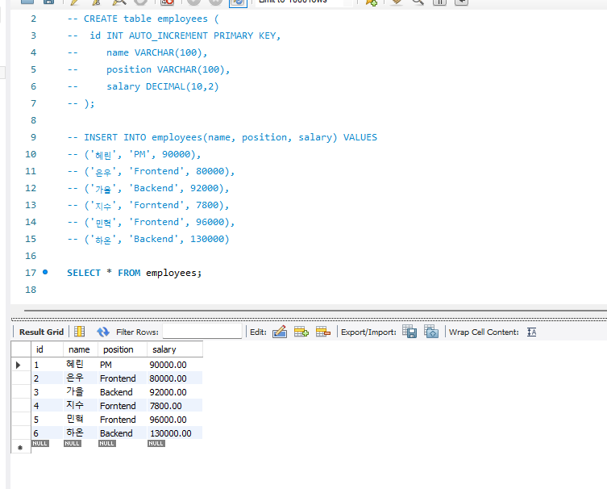
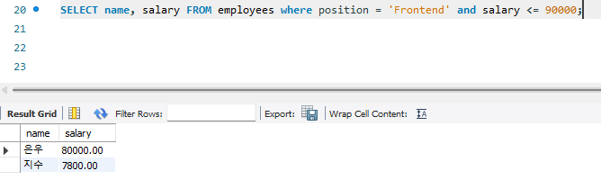
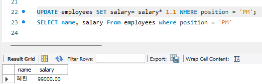
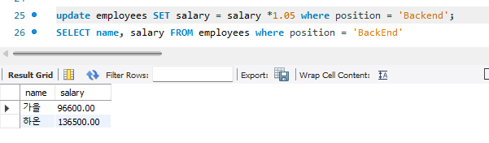
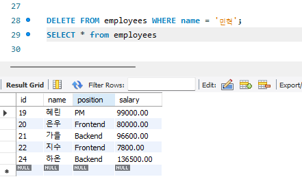
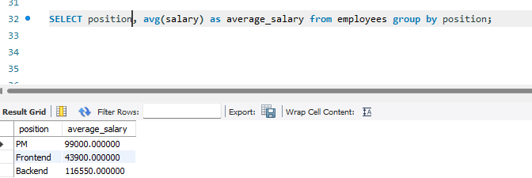
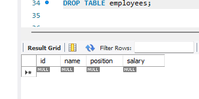

1. **`Frontend` 직책을 가진 직원 중에서 연봉이 90000 이하인 직원의 이름과 연봉을 조회하세요.**
   

2. **`PM` 직책을 가진 모든 직원의 연봉을 10% 인상한 후 그 결과를 확인하세요.**
   

3. **모든 `Backend`' 직책을 가진 직원의 연봉을 5% 인상하세요.**
   

4. **민혁 사원의 데이터를 삭제하세요**
   

5. **모든 직원을 `position` 별로 그룹화하여 각 직책의 평균 연봉을 계산하세요.**
   

6. **`employees` 테이블을 삭제하세요.**
   
